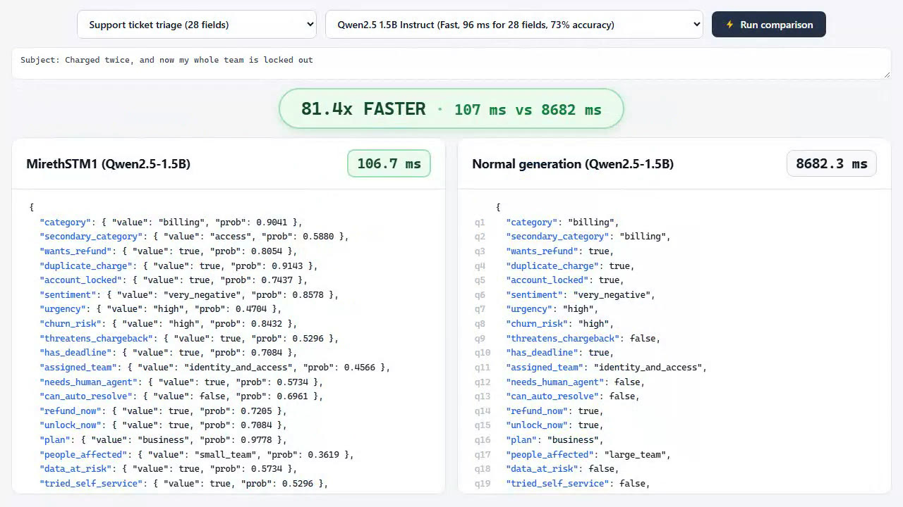

# MirethSTM1

A free, open-source decision engine by Mireth AI: ask typed questions about a text and get a probability for every allowed answer, scored by a local model instead of generated.

## What it is, and what it is not

MirethSTM1 is a free, Apache-2.0, Jev-style approximation of TypeSafe's Jev, not an equivalent. Jev is a model trained for calibrated decisions. MirethSTM1 is an inference method on stock open models, so its probabilities are the base model's own, rescaled by a temperature fitted on held-out labels.

What it does: you plug in a Hugging Face chat model; it reads the real text of every allowed answer (not a single letter or first token) for all questions in one packed pass, with every question answered as if it were asked alone; it returns an expected value and a distribution for score questions; it ships a console that races it against the same model writing the JSON itself; and it publishes accuracy, calibration and speed numbers with the scripts that produced them, measured on Windows with an NVIDIA RTX 5070.

What it is not: the only open engine, the fastest, or the first to read label text. [Laya](https://github.com/NandhaKishorM/laya) trains small encoders that answer in milliseconds, [GLiNER2.5-Decide](https://huggingface.co/fastino/GLiNER2.5-Decide) and [Mapika decider](https://huggingface.co/Mapika/decider-2b) are trained decision models (compared [below](#trained-decision-models-on-the-same-rows)), [jevmlx](https://github.com/bnsd55/jevmlx) also scores label text, and [simple-jev](https://github.com/featherless-ai/simple-jev), [AnyJev](https://github.com/nokia-applied-research/AnyJev), [SemIf](https://github.com/TheoLeeCJ/SemIf-OpenJev), [open-alternative-jev](https://github.com/ikermoel/open-alternative-jev), [jev-style](https://github.com/lawrence3699/jev-style), [Verdict](https://github.com/Heman10x-NGU/Verdict-open-jev) and [von](https://github.com/wfzyx/von) cover overlapping ground. Try them and compare on your own labels before trusting any threshold.

## Status

Pre-release; v0.1 ships 2026-10-04. The engine, the `decide` command, the console and the calibration code pass their tests on CPU (Qwen3-0.6B, Qwen2.5-1.5B-Instruct, SmolLM3-3B and Qwen3-4B-Instruct-2507). The benchmark below ran on the GPU on 2026-10-02; the test results per model, on the GPU and on the CPU, are in [docs/gpu-notes.md](docs/gpu-notes.md). The contract is [SPEC.md](SPEC.md).

## How it works

1. One forward pass reads the text once. In the same pass every question gets a branch of its own that holds only that question, so it is answered as if it were asked alone: no question sees another, and its place in the call does not matter.
2. In its branch, every allowed answer is scored as a whole label (the summed log-probs of all its tokens). Answers that share leading tokens share them in a token tree, so each shared token is computed once.
3. Turn each question's label scores into probabilities with a softmax.
4. Divide the scores by a temperature T before the softmax; T is fitted on held-out labels. Each approved model ships its fitted T (table below); any other model uses 1.0.

Nothing is generated, so `output_tokens` is always 0.

## Install (Windows, NVIDIA)

You need Python 3.10 or newer (tested on 3.11) and an NVIDIA driver recent enough for CUDA 12.8 (572.61 or newer). From the repository folder, in cmd.exe or PowerShell:

```
py -3.11 -m venv .venv
.venv\Scripts\activate
python -m pip install --upgrade pip
pip install torch==2.11.0 --index-url https://download.pytorch.org/whl/cu128
pip install -e .
```

If the `py` launcher is not installed, use `python -m venv .venv` for the first line (or `uv venv --python 3.11 .venv`).

Check that PyTorch sees the GPU. This should print `True`; on an RTX 50-series card the list must include `sm_120`:

```
python -c "import torch; print(torch.cuda.is_available(), torch.cuda.get_arch_list())"
```

Model weights are not bundled. They download from Hugging Face on first use (about 8 GB for the default model). Without a GPU, pass `device="cpu"` (or `--device cpu`); it runs in float32 and is slow for the default model.

Tests: `pip install -e ".[dev]"`, then `pytest` (add the benchmark tests with `pip install -e ".[dev,bench]"`; without it they are skipped). The model tests use Qwen3-0.6B from the local Hugging Face cache and are skipped when it is missing.

## Usage

Questions use TypeSafe's format, so code written for its API maps over directly:

| Type | `criteria` | Answer |
| --- | --- | --- |
| `noul` | optional `{"true": ..., "false": ...}` | `noul`: P(true) |
| `choice` | option name to description (or `null`), 1 to 255 options | `choice`, `confidence`, `probabilities` |
| `score` | ordered list of level descriptions, 1 to 10 levels | `score` (expected level index), `confidence`, `legend`, `probabilities` |

The text (TypeSafe's `state`) is a string or any JSON object or array.

### Python

```python
from mirethstm import Engine

engine = Engine.load("Qwen/Qwen3-4B-Instruct-2507")

questions = {
    "wants_refund": {"type": "noul", "instructions": "Is the customer asking for money back?",
                     "criteria": {"true": "Asks for a refund", "false": "Does not"}},
    "category": {"type": "choice", "instructions": "Which team should handle this?",
                 "criteria": {"billing": "Charges, invoices, refunds", "bug": "Crashes", "other": None}},
    "urgency": {"type": "score", "instructions": "How urgent is this?",
                "criteria": ["No time pressure", "Can wait days", "Needs attention today", "Critical outage"]},
}

text = "I was charged twice for my subscription this month. Please refund one of the charges."
result = engine.decide(text, questions)
print(result["answers"]["category"]["choice"])  # billing

raw = engine.score(text, questions)  # {question: {label: summed log-prob}}, before temperature
```

`Engine.load` also takes `device`, `dtype`, `batch_tokens`, `temperature`, `event_log` and `tarnlight` (see SPEC.md section 4). Any Hugging Face chat model id works in place of the default; models the engine would score wrongly (sliding-window attention, logits changed after the output head) are refused with a clear error.

### Command line

Put the questions map in `s.json` and the text in `ctx.txt`. In cmd.exe or Git Bash:

```
mirethstm decide --schema s.json < ctx.txt
```

PowerShell has no `<`, and piping the file re-encodes it (Windows PowerShell turns accented and other non-ASCII characters into `?` or garbage), so let cmd.exe do the redirect:

```
cmd /c "mirethstm decide --schema s.json < ctx.txt"
```

Options: `--model`, `--temperature`, `--device`, `--batch-tokens`, `--state-json` (read stdin as JSON), `--log events.jsonl` (append one JSON line per question) and `--no-tarnlight`. A bad questions map exits with code 2.

The state is stdin exactly as read, so a final newline in `ctx.txt` is part of it and moves the numbers slightly. Output of the example above with `--model Qwen/Qwen3-0.6B --device cpu --temperature 1` and a `ctx.txt` that ends in one newline (numbers shortened here). This small model at T = 1 is overconfident, which is what the fitted temperature is for: without `--temperature`, its shipped T of 4.639 spreads these probabilities out (billing 0.915, refund 0.868).

```json
{
  "model": "Qwen/Qwen3-0.6B",
  "answers": {
    "wants_refund": {"type": "noul", "noul": 0.9998},
    "category": {"type": "choice", "choice": "billing", "confidence": 0.999993,
                 "probabilities": {"billing": 0.999995, "bug": 2.1e-08, "other": 4.6e-06}},
    "urgency": {"type": "score", "score": 2.1362, "confidence": 0.8149,
                "legend": {"0": "No time pressure", "1": "Can wait days", "2": "Needs attention today", "3": "Critical outage"},
                "probabilities": {"0": 0.0003, "1": 0.0009, "2": 0.8612, "3": 0.1376}}
  },
  "usage": {"input_tokens": 247, "output_tokens": 0},
  "id": "fe51c516c20c4a498459f42bf6045518",
  "latency_ms": 600.0
}
```

## Console

```
mirethstm console
```

Opens a local page at http://127.0.0.1:8766 that races MirethSTM1 against the same model writing the JSON itself, side by side, like the demo that started this project. Pick a scenario and a model, edit the text if you like, and press Run comparison. The left card shows every answer with its probability at once. The right card shows the model's own JSON as it is generated, with answers outside the allowed set marked as hallucinated. A pill on top shows how many times faster MirethSTM1 was (or slower, when it was). The default model is Qwen/Qwen2.5-1.5B-Instruct, the original demo's model; switch models from the page. Options: `--model`, `--device`, `--host`, `--port`, `--no-tarnlight`.



## Tarnlight

If [Tarnlight](https://github.com/TheChyeahhh/tarnlight) is installed, every decision (from the SDK, the CLI or the console) also shows up there live. MirethSTM1 never needs it: nothing is written unless Tarnlight's drop folder already exists, and a failed write never fails a decision. Turn it off with `tarnlight=False` or `--no-tarnlight`.

## Models and licenses

The console's model picker and `GET /v1/models` offer the approved models below. A model is approved when its license allows free commercial use, it fits a 12 GB card, `Engine.load` accepts it, the model test suite passes on the GPU, and its speed, accuracy and calibration are measured (SPEC 11.1). Any other Hugging Face id still loads, unvetted.

| Model | Role | License | 28 fields | 255-option router | Accuracy | ECE at T = 1 | ECE at shipped T | Shipped T | Peak GPU memory |
| --- | --- | --- | --- | --- | --- | --- | --- | --- | --- |
| [Qwen/Qwen2.5-1.5B-Instruct](https://huggingface.co/Qwen/Qwen2.5-1.5B-Instruct) | console default and fast mode (the original demo's model) | Apache-2.0 | 96.4 ms | 209 ms | 0.728 | 0.148 | 0.109 | 2.112 | 3550 MiB |
| [Qwen/Qwen3-4B-Instruct-2507](https://huggingface.co/Qwen/Qwen3-4B-Instruct-2507) | SDK and CLI default | Apache-2.0 | 271 ms | 615 ms | 0.760 | 0.230 | 0.117 | 7.930 | 8336 MiB |
| [Qwen/Qwen3-1.7B](https://huggingface.co/Qwen/Qwen3-1.7B) | alternative | Apache-2.0 | 111 ms | 248 ms | 0.726 | 0.238 | 0.097 | 7.007 | 3889 MiB |
| [Qwen/Qwen3-0.6B](https://huggingface.co/Qwen/Qwen3-0.6B) | CPU tests | Apache-2.0 | 63.7 ms | 156 ms | 0.575 | 0.339 | 0.137 | 4.639 | 1739 MiB |
| [HuggingFaceTB/SmolLM3-3B](https://huggingface.co/HuggingFaceTB/SmolLM3-3B) | alternative | Apache-2.0 | 213 ms | 408 ms | 0.688 | 0.190 | 0.061 | 2.702 | 6493 MiB |

Measured on one RTX 5070 in bf16 on 2026-10-02. 28 fields and router: p50 of a warm `decide` call on the console's support-triage scenario and its 255-option router. Accuracy: MirethSTM1's mean over the five benchmark datasets below (1,000 rows per dataset for the first two models, 500 for the other three). ECE: the mean 15-bin ECE over the same datasets. Shipped T: the temperature `Engine.load` applies by default. Peak GPU memory: the largest of any MirethSTM1 run in the latency benchmark.

Three things to know before picking one:

- Fast mode is Qwen2.5-1.5B-Instruct: it is quicker than Qwen3-1.7B in every setting we timed (28 fields 96 ms against 111 ms, 1 to 10 fields 35 to 37 ms against 43 to 45 ms) at the same accuracy on the 500 rows per task both ran (0.729 against 0.726).
- Qwen3-0.6B answers yes to almost every yes/no question (SST-2 as yes/no: 0.542 right, 96% answered yes; the same sentences as a two-option choice: 0.848). Use it for tests, not for decisions.
- SmolLM3's chat template writes today's date into the prompt, so its numbers were measured with the date 2026-10-02 and can shift on other days.

Evaluated and not approved:

- [Qwen/Qwen2.5-0.5B-Instruct](https://huggingface.co/Qwen/Qwen2.5-0.5B-Instruct): on 2026-10-01 its bf16 scores drifted past the GPU test band (fp32 passed), so it was not benchmarked. It has not been re-run since.
- [microsoft/Phi-4-mini-instruct](https://huggingface.co/microsoft/Phi-4-mini-instruct) (MIT): `Engine.load` refuses it, because its config declares sliding-window attention.
- [ibm-granite/granite-3.3-2b-instruct](https://huggingface.co/ibm-granite/granite-3.3-2b-instruct): `Engine.load` refuses it, because its forward rescales the logits after the output head.

Weights are not bundled; each downloads under its own license. Qwen2.5-3B is under the Qwen Research License (non-commercial only), so it is not used.

## Benchmark

Full tables with confidence intervals, per-dataset temperatures, reliability diagrams and every arm: [docs/benchmark.md](docs/benchmark.md), written by `python -m bench.report` and nothing else. The GPU setup, the attention kernels and a bf16, fp16 and fp32 comparison: [docs/gpu-notes.md](docs/gpu-notes.md). Everything below is our own run on one RTX 5070 in bf16, 2026-10-02.

Five tasks, each asked as one TypeSafe question: AG News (`fancyzhx/ag_news`, choice of 4 topics), Banking77 (`mteb/banking77`, choice of 77 intents), SST-2 (`stanfordnlp/sst2` validation, once as yes/no and once as a two-option choice) and Yelp (`Yelp/yelp_review_full`, score with 5 levels). Each model answers them three ways, with the same question text:

- MirethSTM1: every token of every allowed answer, scored in one pass.
- First token: only the first token of each answer's name, the original demo's method (our reimplementation). It follows the demo's PyTorch path; the demo's Mac build generates a few tokens when first tokens collide, which this arm does not do.
- Normal generation: the same model writes the JSON itself with Hugging Face `generate` (greedy); an invalid, made-up or missing answer counts as wrong.

### Accuracy and calibration

Mean over the five tasks. ECE is top-label with 15 equal-width bins (Guo et al. 2017), at T = 1 and at the shipped T, one scalar per model fitted on separate calibration rows.

| Model | MirethSTM1 | First token | Normal generation (valid answers) | Banking77: MirethSTM1 / first token | ECE at T = 1 | ECE at shipped T |
| --- | --- | --- | --- | --- | --- | --- |
| Qwen2.5-1.5B-Instruct | 0.728 | 0.694 | 0.555 (0.850) | 0.494 / 0.313 | 0.148 | 0.109 |
| Qwen3-4B-Instruct-2507 | 0.760 | 0.702 | 0.611 (0.849) | 0.670 / 0.380 | 0.230 | 0.117 |
| Qwen3-1.7B | 0.726 | 0.690 | 0.515 (0.758) | 0.500 / 0.326 | 0.238 | 0.097 |
| SmolLM3-3B | 0.688 | 0.671 | 0.572 (0.846) | 0.300 / 0.210 | 0.190 | 0.061 |
| Qwen3-0.6B | 0.575 | 0.532 | 0.008 (0.008) | 0.464 / 0.270 | 0.339 | 0.137 |

- Rows: 1,000 evaluation rows per task (SST-2: all 872) for Qwen2.5-1.5B-Instruct and Qwen3-4B-Instruct-2507, and 500 for the other three. Normal generation ran 300 rows per task (100 for SmolLM3-3B and Qwen3-0.6B) on 2026-10-01; its prompt has not changed since (the prompt tokens of all 7,500 rows are identical before and after the change; SmolLM3-3B's generation rows carry the 2026-10-01 date line), so those files were kept. On the 500 rows per task that all five models ran, MirethSTM1 scores 0.729, 0.751, 0.726, 0.688 and 0.575 in the table's order, so the ranking holds.
- Reading the whole answer matters when answers share their first token. On Banking77, 48 of the 77 intents share their first token with another intent, so the first-token method falls back to a tie rule. On the other four tasks the two methods are within one point of each other, in either direction.
- Normal generation is checked strictly. Qwen3 models often write `"true"` as a string, which counts as invalid (Qwen3-4B-Instruct-2507 gets 0.250 on SST-2 yes/no for that reason, Qwen3-1.7B 0.033), and Qwen3-0.6B rarely finishes its JSON within the token budget.
- At T = 1 every model is overconfident. One fitted T per model removes most of it, not all: at the shipped T, Yelp keeps an ECE of 0.122 on Qwen2.5-1.5B-Instruct and 0.298 on Qwen3-4B-Instruct-2507. Yes/no questions want a smaller T than choice and score questions on two models, so the shipped T makes SST-2 yes/no worse there: 0.070 to 0.199 on Qwen2.5-1.5B-Instruct and 0.070 to 0.202 on Qwen3-1.7B. Fit your own T on your own labels when you can.
- Harder questions: on the 231 public items of JevBench (fetched from its repository and scored by us, not an official JevBench score), the hard tier stays close to its chance level of 0.336 for Qwen2.5-1.5B-Instruct (0.342), Qwen3-1.7B (0.288) and Qwen3-0.6B (0.360); SmolLM3-3B reaches 0.396 and Qwen3-4B-Instruct-2507 0.441.
- Against the previous engine, which answered all questions in one shared prompt (the 2026-10-01 run, `docs/benchmark.md` at commit 18c2455), on the same rows: the mean of the five tasks moved from 0.713 to 0.728 on Qwen2.5-1.5B-Instruct, 0.752 to 0.760 on Qwen3-4B-Instruct-2507, 0.697 to 0.726 on Qwen3-1.7B, 0.672 to 0.688 on SmolLM3-3B and 0.581 to 0.575 on Qwen3-0.6B. Not every task gained: with the shorter prompt Qwen2.5-1.5B-Instruct lost 5 points on Banking77 (0.545 to 0.494), SmolLM3-3B lost 4 on SST-2 yes/no (0.856 to 0.818) and Qwen3-0.6B lost 7 on Yelp (0.350 to 0.276), while Yelp gained 10 points on Qwen2.5-1.5B-Instruct and 13 on Qwen3-1.7B. On the public items four of five models dipped on the standard tier (Qwen3-4B-Instruct-2507 0.750 to 0.708, and 0.477 to 0.441 on the hard tier); pooled over all models 80 items were lost and 63 gained, which is within noise.

### Many questions in one call

The previous engine put all questions of a call into one prompt, and a question's answer then depended on where it stood. Measured on Qwen2.5-1.5B-Instruct with 200 AG News articles and five checked questions (the topic, and four yes/no questions that follow from it), asked alone and inside one 20-question call next to 15 filler questions: 0.864 right alone, 0.809 when placed first, 0.575 when placed last and 0.500 when spread out. Later yes/no questions were answered yes for every article.

Now every question has a branch of its own (How it works, step 1), so the answers are equal by construction. The same test, mean accuracy of the five checked questions (`python -m bench.multifield`):

| Model | Alone, one call per question | In a call of 20: first | Last | Spread out | Same answer as alone | Same run in fp32 |
| --- | --- | --- | --- | --- | --- | --- |
| Qwen2.5-1.5B-Instruct, previous engine | 0.864 | 0.809 | 0.575 | 0.500 | not recorded | not run |
| Qwen2.5-1.5B-Instruct | 0.842 | 0.842 | 0.842 | 0.841 | 99.1% to 99.4% | 0.845 in all four, 100% |
| Qwen3-4B-Instruct-2507 | 0.879 | 0.876 | 0.878 | 0.876 | 99.7% | does not fit the card |
| Qwen3-1.7B | 0.864 | 0.866 | 0.865 | 0.865 | 99.3% to 99.4% | 0.868 in all four, 100% |
| SmolLM3-3B | 0.858 | 0.861 | 0.860 | 0.859 | 99.5% to 99.6% | does not fit the card |
| Qwen3-0.6B | 0.755 | 0.755 | 0.753 | 0.753 | 99.4% to 99.6% | 0.744 in all four, 100% |

- In fp32 a question scores the same wherever it sits (largest difference 0.001 in summed log-prob), so the few answers that differ in bf16 are rounding, not one question leaking into another. They sit where the two top labels score almost the same (a gap of 0.4 or less in summed log-prob for most of them; the largest was 1.6, on Qwen3-0.6B).
- The price: alone, Qwen2.5-1.5B-Instruct went from 0.864 to 0.842 on these five questions with the shorter prompt the branches use. It still answers yes too often on one of them (world news: yes for 51% of the articles, true share 25%); that is the model, and it is the same in every placement.
- The latency runs ask a topic plus rule-checked yes/no questions ("does the text contain a digit?"). At 20 fields Qwen2.5-1.5B-Instruct now gets 0.67 of the fields right against 0.66 for normal generation; the previous engine got 0.50. Qwen3-4B-Instruct-2507 went the other way, 0.71 to 0.67. Small models are weak at such character-level rules either way (0.61 to 0.79 across the five models).

### Speed

p50 wall time of one `decide` call, warm, batch 1, bf16, RTX 5070. Normal generation is the same loaded model writing the same answers as one JSON object with Hugging Face `generate` (greedy decoding) on the same GPU.

| Schema | Original demo, as published (M4 Max, 4-bit) | Qwen2.5-1.5B-Instruct | Same model, normal generation | Qwen3-4B-Instruct-2507 | Qwen3-1.7B | SmolLM3-3B | Qwen3-0.6B |
| --- | --- | --- | --- | --- | --- | --- | --- |
| Small: 4 fields (demo), 5 fields (ours) | 75 ms | 35.7 ms | 1269 ms | 67.4 ms | 43.5 ms | 51.6 ms | 42.9 ms |
| 28 fields | 270 ms | 96.4 ms | 8214 ms | 271 ms | 111 ms | 213 ms | 63.7 ms |
| 255 options | 89 ms | 209 ms | 1461 ms | 615 ms | 248 ms | 408 ms | 156 ms |

- The "times faster" figure depends on the baseline. Hugging Face `generate` writes about 24 tokens per second here on Qwen2.5-1.5B-Instruct (14 to 24 across the five models), and a 28-field answer is about 206 tokens, so 28 fields come out 85 times faster and the router 7 times faster. A faster generation stack would shrink both numbers; MirethSTM1's own times would not change.
- The demo's numbers are not like for like. They come from its README, measured on a Mac with an M4 Max on 4-bit MLX weights of Qwen2.5-1.5B-Instruct, on its own prompts, scoring only the first token of each label, with no raw logs. Ours run on an NVIDIA RTX 5070 with bf16 weights, on our own scenario texts, and score every token of every label.
- Our 255-option router is slower than the demo's figure. Its one pass is 2,782 tokens: 143 for the system message and the state, 1,804 for the routing question, which lists all 255 queues with their descriptions, 737 for the label tree of those queues and 98 for the other three questions (`usage.input_tokens` reports 3,325, because it counts shared label tokens once per label). The demo's prompt and hardware differ, so the gap cannot be split between method and setup.
- On the three smallest models a call costs 35 to 45 ms however few fields it has (1, 5 and 10 fields take the same time). That is per-layer overhead on this Windows machine, not model work, so a smaller model is not faster on small schemas. Normal generation's prompt pass also runs on a slower attention kernel than MirethSTM1 on this Windows build ([docs/gpu-notes.md](docs/gpu-notes.md)), so the speedups are not a pure method comparison.

To reproduce (`pip install -e ".[bench]"`; every script skips files that already exist, so an interrupted run resumes):

```
python -m bench.run_bench --model Qwen/Qwen2.5-1.5B-Instruct --arms mireth,first_token --n 1000 --n-cal 500 --out v2
python -m bench.run_bench --model Qwen/Qwen2.5-1.5B-Instruct --arms baseline --n 300 --out v2
python -m bench.latency --model Qwen/Qwen2.5-1.5B-Instruct --runs 30 --out v2
python -m bench.public_items --model Qwen/Qwen2.5-1.5B-Instruct --out v2
python -m bench.multifield --model Qwen/Qwen2.5-1.5B-Instruct --n 200 --out v2
python -m bench.run_bench --model Qwen/Qwen2.5-1.5B-Instruct --arms mireth --n 500 --n-cal 500 --dtype float16 --out v2-fp16
python -m bench.run_bench --model Qwen/Qwen2.5-1.5B-Instruct --arms mireth --n 500 --n-cal 500 --dtype float32 --out v2-fp32
python -m bench.multifield --model Qwen/Qwen2.5-1.5B-Instruct --n 200 --dtype float32 --out v2-fp32
python -m bench.report --run v2 --md docs/benchmark.md --figures docs/benchmark
```

The other models use the same commands with their own `--model`: Qwen3-4B-Instruct-2507 with the same sizes, and Qwen3-1.7B, SmolLM3-3B and Qwen3-0.6B with `--n 500 --n-cal 300` and `--runs 10` (normal generation `--n 300` for Qwen3-1.7B, `--n 100` for the last two). The fp16 and fp32 runs exist for Qwen2.5-1.5B-Instruct, and the fp32 `bench.multifield` run for the three models whose fp32 weights fit the card. `bench.report` reads the `v2-fp16` and `v2-fp32` folders by name for its Precision section. `bench.public_items` downloads the public items from GitHub at a pinned commit, also when the Hugging Face cache is offline; `--items-dir` reads them from a local folder.

Design: [docs/research/07-benchmark-design.md](docs/research/07-benchmark-design.md).

### Trained decision models on the same rows

Other open models are trained to make typed decisions. We ran two of them on rows of the same five tasks on 2026-10-01 ([docs/research/17-open-weight-decision-models.md](docs/research/17-open-weight-decision-models.md)). Accuracy on the same 300 rows per task, about 0.05 either way per cell:

| Task | [fastino/GLiNER2.5-Decide](https://huggingface.co/fastino/GLiNER2.5-Decide) | MirethSTM1, Qwen2.5-1.5B-Instruct | MirethSTM1, Qwen3-4B-Instruct-2507 |
| --- | --- | --- | --- |
| AG News | 0.740 | 0.827 | 0.863 |
| Banking77 | 0.700 | 0.480 | 0.670 |
| SST-2 yes/no | 0.877 | 0.890 | 0.873 |
| SST-2 choice | 0.887 | 0.913 | 0.897 |
| Yelp | 0.560 | 0.500 | 0.433 |
| Mean | 0.753 | 0.722 | 0.747 |

- GLiNER2.5-Decide is an encoder with a trained label head, not a language model. On the mean it is level with MirethSTM1 on Qwen3-4B-Instruct-2507: behind on AG News, ahead on Yelp, and well ahead of the small model on Banking77.
- [Mapika/decider-2b](https://huggingface.co/Mapika/decider-2b) scores higher: mean 0.858 on 100 rows per task, against 0.724 and 0.754 for the two MirethSTM1 columns on those rows. Its public training code lists AG News, Banking77, SST-2 and Yelp as training tasks, the four datasets behind these five tasks, so this is not a zero-shot comparison. Whether GLiNER2.5-Decide was trained on them is not published.
- The MirethSTM1 columns are today's engine (the 2026-10-02 run), read from that run's files for the same rows. The linked note was written against the previous day's engine, so its MirethSTM1 numbers differ slightly.
- Both trained models were run by us on the CPU, each called its own way. Speed was not compared on the GPU.
- GLiNER2.5-Decide reads about 512 tokens and does not warn past that (a 77-option question sends 533 to 587 tokens).
- Neither plugs into this engine today: GLiNER2.5-Decide has no language-model head to score, and `Engine.load` refuses decider-2b because 18 of its 24 layers use linear attention.

## Credits

These projects shaped the design. They are credited as inspiration; no code was copied from them.

- [Harsha Gundala's Qwen-2.5-1B-RLCD](https://huggingface.co/harshatheg/Qwen-2.5-1B-RLCD): prefill once, then score every field in parallel from the shared cache.
- [shreyansh26's Transformers port](https://huggingface.co/shreyansh26/Qwen-2.5-1B-RLCD): scoring colliding labels by their full text, in cached chunks.
- [razorback16/openjev](https://github.com/razorback16/openjev): the TypeSafe-compatible wire format.
- [jaredpalmer/kev](https://github.com/jaredpalmer/kev): the calibration metric protocol (held-out fits, ECE, NLL, Brier, bootstrap intervals).
- [Guo et al. 2017, On Calibration of Modern Neural Networks](https://arxiv.org/abs/1706.04599): temperature scaling and ECE.

## Trademark

Jev is a trademark of TypeSafe AI. MirethSTM1 is not affiliated with or endorsed by TypeSafe AI.

## License

Apache-2.0. See [LICENSE](LICENSE).
